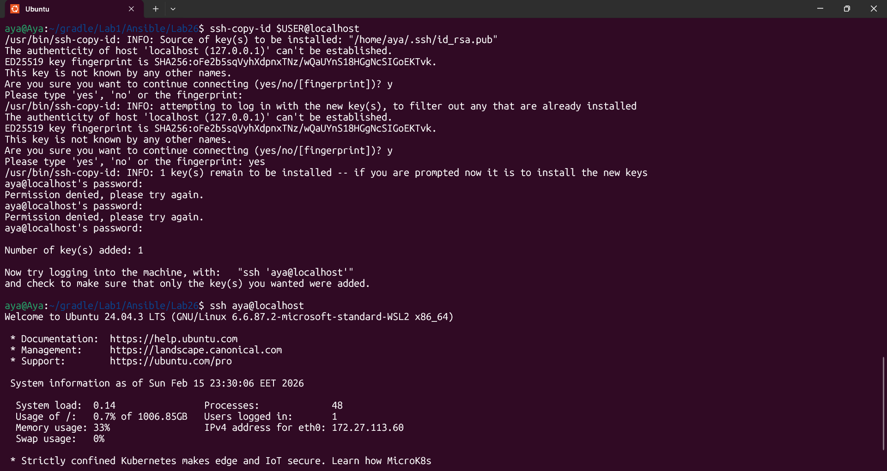
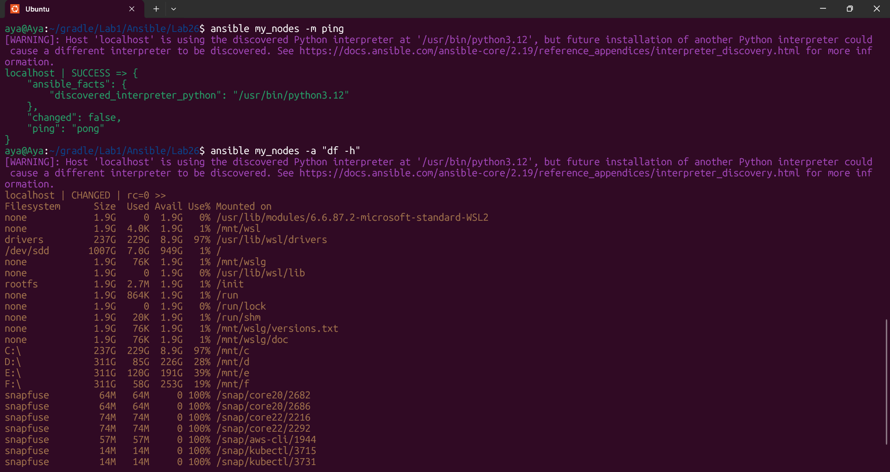

# Lab 26: Initial Ansible Configuration and Ad-Hoc Execution
## Overview
This lab covers the initial setup of Ansible on a local Ubuntu control node and performing basic ad-hoc commands to manage the system.

## Prerequisites
Operating System: Ubuntu (Control Node & Managed Node)

Ansible installed (sudo apt install ansible)

SSH server running (sudo apt install openssh-server)

## Steps Applied
### 1. Project Directory Setup
Created a dedicated directory for Ansible labs to keep the configuration organized.

```Bash
mkdir ansible-lab && cd ansible-lab
```

### 2. SSH Key Generation
Generated a new RSA key pair on the control node without a passphrase for automated access.

```Bash
ssh-keygen -t rsa -N "" -f ~/.ssh/id_rsa
```

### 3. SSH Key Distribution (Local)
Transferred the public key to the local machine to allow passwordless SSH access for Ansible.

```Bash
ssh-copy-id $USER@localhost
```

### 4. Inventory Configuration
Created an inventory file to define the target managed nodes.

Ini, TOML
[my_nodes]
localhost  ansible_connection=local

### 5. Ansible Configuration
Created an ansible.cfg file to set default paths and behavior.

Ini, TOML
[defaults]
inventory = ./inventory
host_key_checking = False

### 6. Verification and Ad-Hoc Execution
Tested the connection and performed system checks using Ansible ad-hoc modules.

Ping Test: Verifies Python availability and connectivity.

```Bash
ansible my_nodes -m ping
```

Disk Space Check: Executes a shell command to check storage.

```Bash
ansible my_nodes -a "df -h"
```

Results
Connection: Successful (Received "pong").

Execution: System disk space details were retrieved successfully through Ansible.

### 7. Validation 





---
