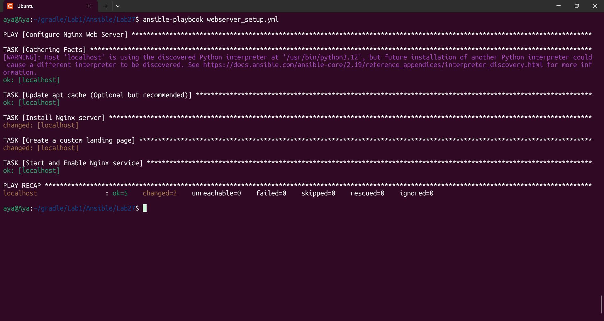
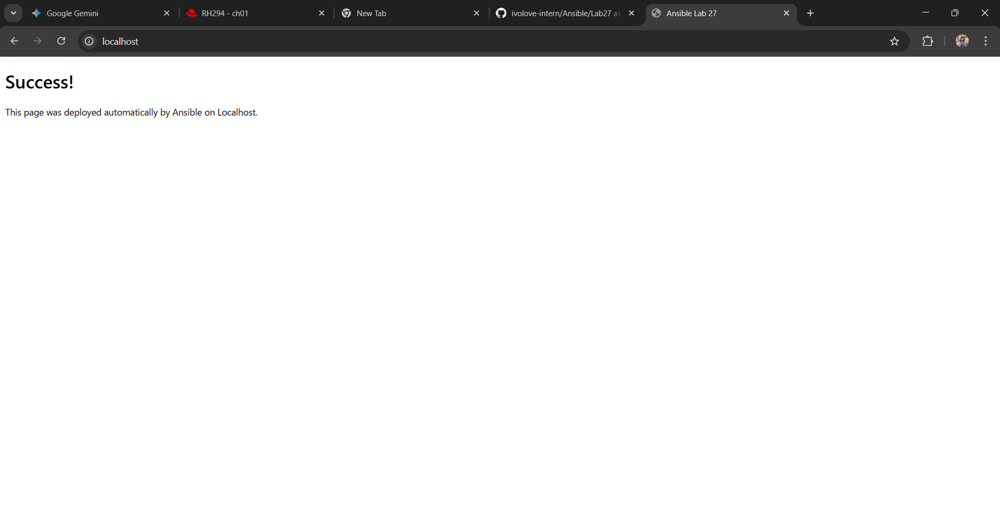

# Lab 27: Automated Web Server Configuration Using Ansible Playbooks

## Overview

This lab demonstrates the transition from ad-hoc commands to structured automation using Ansible Playbooks. The goal is to automate the installation, configuration, and verification of an Nginx web server on a managed node (localhost).

## Lab Objectives

Write an Ansible playbook in YAML format.

Automate the installation of the Nginx package.

Customize the default web page (index.html).

Ensure the service is started and enabled on boot.

Verify the configuration on the managed node.

## File Structure

inventory: Contains the target host (localhost).

ansible.cfg: Configures default behavior.

webserver_setup.yml: The main playbook containing the tasks.

## Playbook Tasks Explained

Install Nginx: Uses the apt module to ensure the package is present.

Customize Web Page: Uses the copy module to inject custom HTML content into /var/www/html/index.html.

Service Management: Uses the service module to ensure Nginx is started and enabled.

## Results & Verification

Idempotency: Running the playbook a second time results in changed=0, proving that Ansible only applies changes if the system is not in the desired state.

Service Check: Verified by accessing http://localhost via browser/curl.

Output: The custom message "This page was deployed automatically by Ansible" is successfully displayed.

