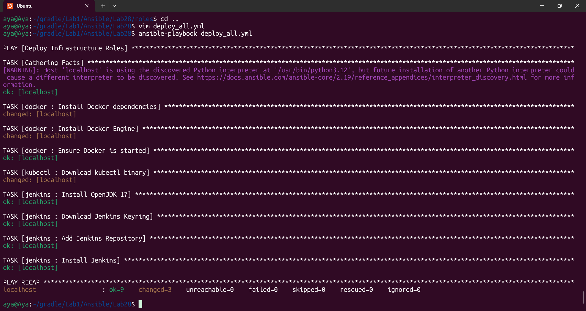

# Lab 28: Structured Configuration Management with Ansible Roles
## Overview
Successfully transitioned from a monolithic playbook to a Modular Role-based Architecture. This lab automates the installation of Docker, Kubectl, and Jenkins using separate, reusable roles.

## Project Structure
The project follows the standard Ansible Galaxy structure:

Docker Role: Manages container engine installation.

Kubectl Role: Handles binary downloads and permissions.

Jenkins Role: Manages repositories, GPG keys, and service status.

## Why Roles?
Reusability: I can copy the docker role to any future project.

Maintainability: Each tool has its own dedicated directory and variable set.

Scalability: Easy to add more tools (like Terraform or Ansible Vault) by just initiating a new role.

## Verification

