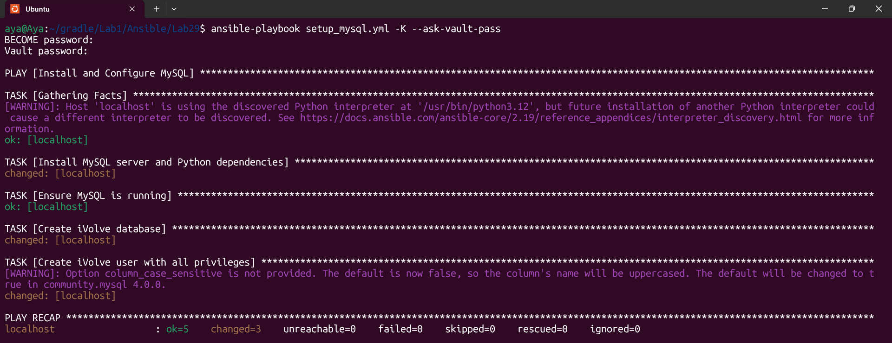
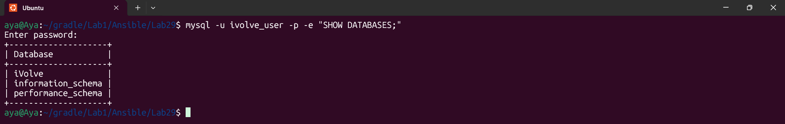

# Lab 29: Securing Sensitive Data with Ansible Vault

## Overview

Automated the installation of MySQL and the creation of a secured database environment while implementing Ansible Vault for sensitive data encryption.

## Tasks Accomplished

MySQL Setup: Automated installation of mysql-server and python3-pymysql.

Database Creation: Created a database named iVolve.

User Permissions: Created ivolve_user with full privileges on the iVolve DB.

Security: Encrypted the database passwords using an AES-256 encrypted vault file (secrets.yml).



## Challenges Faced

APT Cache Timeout: Encountered issues with repository updates; resolved by setting update_cache: no to rely on local package metadata.

Privilege Escalation: Managed sudo access using the --ask-become-pass flag.

## Verification Command

```Bash
# Verify DB access with the encrypted password
mysql -u ivolve_user -p -e "SHOW DATABASES;"
```


