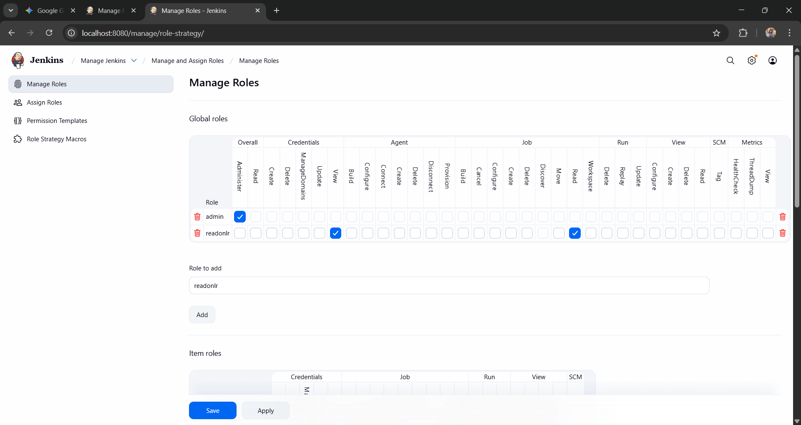
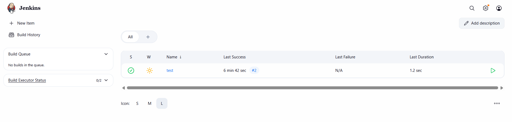
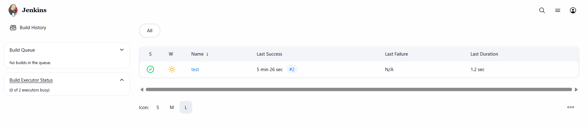

# Lab 21: Jenkins Role-Based Authorization

## Description
Implementation of RBAC (Role-Based Access Control) in Jenkins to manage user permissions efficiently.

## Steps
Plugin: Installed Role-based Authorization Strategy.

Setup: Enabled Role-Based Strategy in Global Security.

Users: Created user1 and user2.

Roles:

Admin: Full permissions (for user1).

Read-only: Overall/Read + Job/Read permissions (for user2).

Assignment: Mapped users to their respective roles in Assign Roles.

## Verification
user1: Full administrative control.

user2: Can only view the dashboard and pipelines (No build/edit access).

