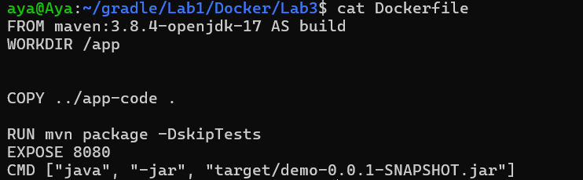
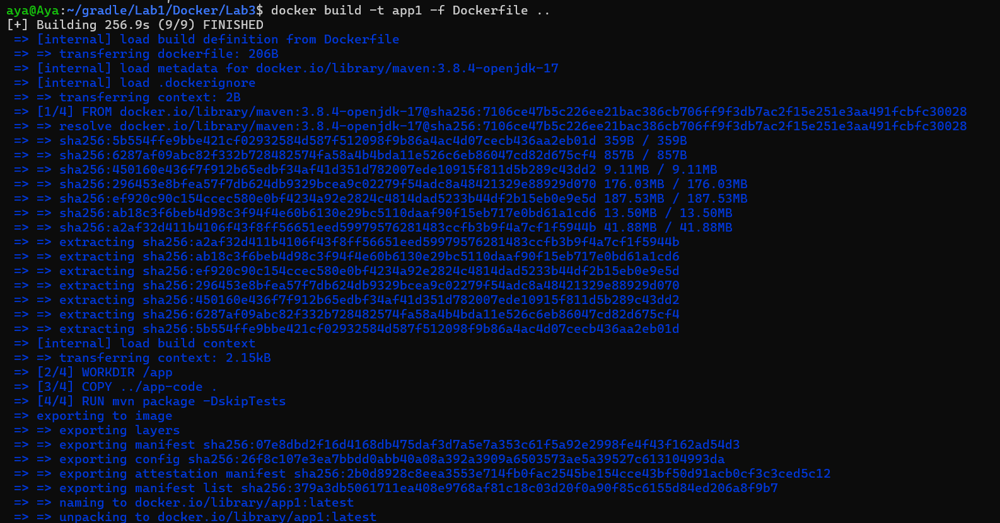
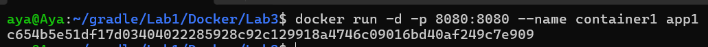
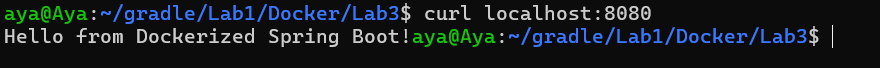
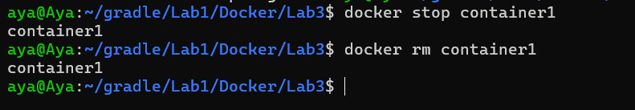

# Lab 3: Running Java Spring Boot App in a Docker Container

In this lab, I containerized a Spring Boot application using Docker, starting from a Dockerfile build to running and testing the container.

---

### 1. Dockerfile Configuration
The Dockerfile was created using a Maven base image with Java 17, copying the source code, and building the JAR file.


### 2. Building the Image
I built the Docker image with the tag `app1`.
```bash
docker build -t app1 -f Dockerfile ..
```


### 3. Running the Container
A container named `container1` was started from the `app1` image, mapping port 8080.
```bash
docker run -d -p 8080:8080 --name container1 app1
```


### 4. Testing the Application
The application was verified as working by accessing `localhost:8080`.
```bash
curl localhost:8080
```


### 5. Cleanup
Finally, the container was stopped and removed to clean up the environment.
```bash
docker stop container1
docker rm container1
```


---

## Summary

This lab demonstrates the full workflow of running a Spring Boot application inside a Docker container:

- Clone the application code from GitHub
- Write a Dockerfile using Maven and Java 17
- Build a Docker image
- Run a container from the image
- Test the application on port 8080
- Stop and delete the container
