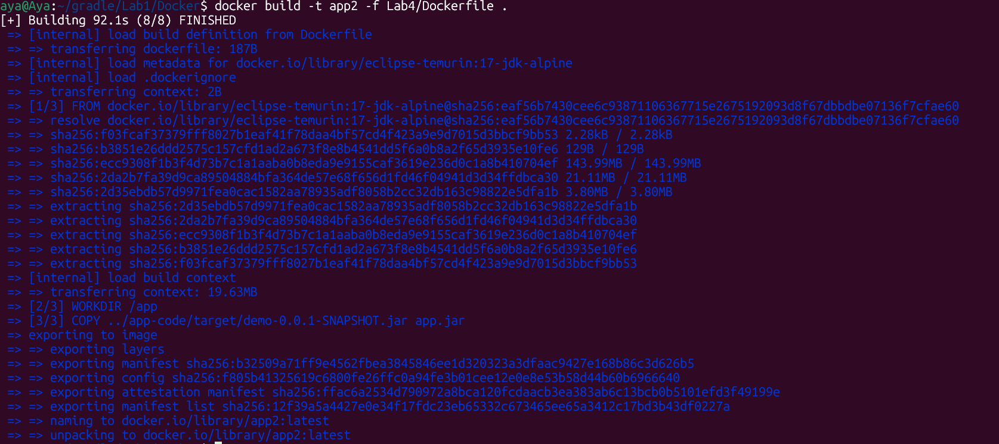
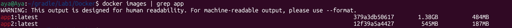
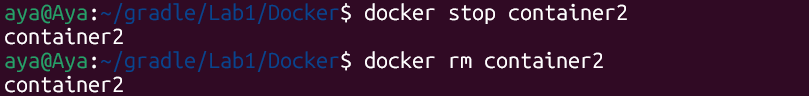

# Lab 4: Run Java Spring Boot App (Single-Stage Build)

In this lab, I containerized a Spring Boot application by copying a pre-built JAR file into a lightweight Java 17 runtime image.

---

### 1. Dockerfile Configuration
The Dockerfile uses a lightweight Alpine-based Java 17 image. It focuses on running the app rather than building it:
-	Base Image: eclipse-temurin:17-jdk-alpine
-	Working Dir: /app
-	Copy: Transfers the pre-built JAR from target/ to the container.
-	Port: Exposes 8080.


### 2. Building the Image
The image was built from the root directory to include the app-code context:
```bash
docker build -t app2 -f Lab4/Dockerfile .
```



### 3. Running the Container
A container named `container2` was started from the `app2` image, mapping port 8081.
```bash
docker run -d -p 8081:8080 --name container2 app2
```


### 4. Testing the Application
The application was verified as working by accessing `localhost:8081`.
```bash
curl localhost:8081
```


### 5. Cleanup
Finally, the container was stopped and removed to clean up the environment.
```bash
docker stop container2
docker rm container2
```


---

## Summary

This lab demonstrates an optimized workflow for running a Spring Boot application by focusing on a Runtime-only Docker container:

- Clone the application code from GitHub
- Manual Build: Pre-packaged the Java application into a JAR file using Maven on the host machine.
- Lightweight Base Image: Used an Alpine-based Java 17 image to ensure a smaller and more secure container footprint.
- Separation of Concerns: Improved build speed by copying only the necessary JAR file instead of the entire source code.
- Test the application on port 8081
- Stop and delete the container


