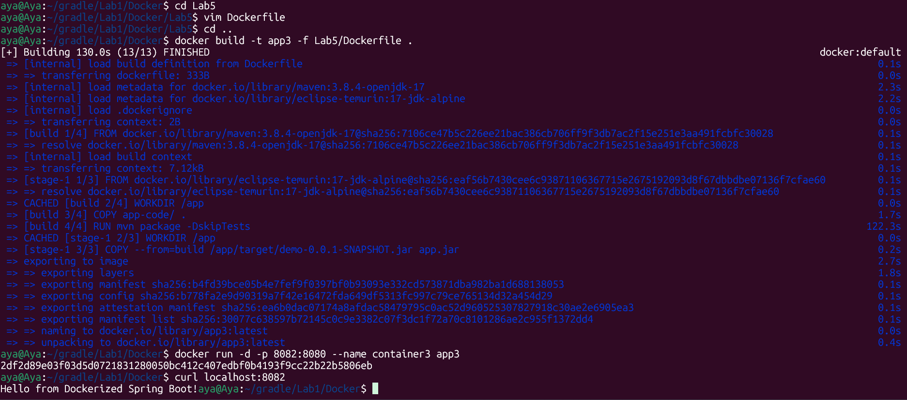
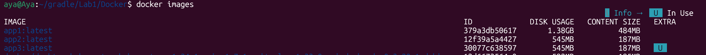
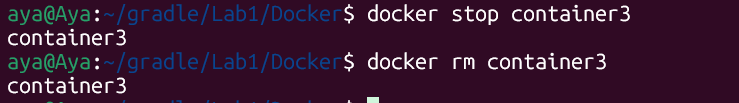

# Lab 5: Multi-Stage Build for Java Spring Boot App

In this lab, I implemented a Multi-Stage Build process. This technique allows for building the application and running it in two separate stages within a single Dockerfile, resulting in a highly optimized and smaller production image.

---

### 1. Multi-Stage Dockerfile Configuration

The Dockerfile is divided into two stages:

**Stage 1** (Build): Uses a Maven base image to compile the source code and package it into a JAR file.
**Stage 2** (Run): Uses a slim Java runtime image, copying only the generated JAR file from the first stage.

### 2. Building the Optimized Image
I built the Docker image with the tag app3. Notice that we don't need to run Maven manually on the host; Docker handles everything.

```bash
docker build -t app3 -f Lab5/Dockerfile
```

### 3. Running the Container
A container named container3 was started from the app3 image, mapping port 8082 to the internal port 8080.

```bash
docker run -d -p 8082:8080 --name container3 app3
```
### 4. Testing the Application
The application was verified by sending a request to port 8082.

```bash
curl localhost:8082
```



### 5. Cleanup
The environment was cleaned by stopping and removing the container.

```bash
docker stop container3
docker rm container3
```


---

## Summary

This lab demonstrates the advanced Multi-Stage Build workflow to create highly optimized Docker images:

- Automated Build Stage: Used a Maven base image to compile and package the application directly inside a container.
- Source Code Protection: Copied the entire application code into the first stage to build the JAR, then discarded the source code in the final image.
- Efficient Production Image: Used a lightweight Java runtime image for the second stage, significantly reducing the final image size.
- Artifact Transfer: Successfully copied only the required JAR file from the 'build' stage to the 'run' stage.
- Optimized Deployment: Verified the application on port 8082, demonstrating a production-ready container that contains no unnecessary build tools.
