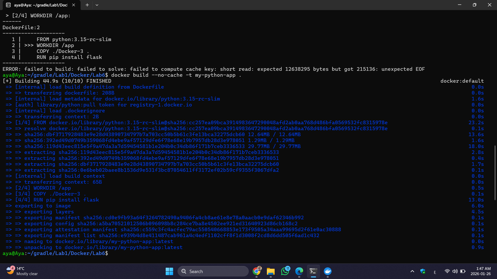

# Lab 6: Managing Docker Environment Variables

This lab demonstrates how to manage environment variables in a Dockerized Flask application using three different methods: Command-line flags, Environment files, and Dockerfile defaults.

---

## Build the Image



## Running Containers (3 Scenarios)


### Scenario I: Direct Environment Variables (Development)
Passing variables directly using the -e flag.

Bash
```bash 
docker run -d --name container-dev \
  -p 8081:8080 \
  -e APP_MODE=development \
  -e APP_REGION=us-east \
  my-python-app
```

### Scenario II: Using an Environment File (Staging)
Create a file named staging.env with the following content:

APP_MODE=staging
APP_REGION=us-west

Run the container using the --env-file flag:

```bash
docker run -d --name container-staging \
  -p 8082:8080 \
  --env-file env-file.txt \
  my-python-app
````

### Scenario III: Using Dockerfile Defaults (Production)
Run the container without any extra flags to use the ENV values defined in the Dockerfile.

```bash

docker run -d --name container-prod \
  -p 8083:8080 \
  my-python-app

```

---

