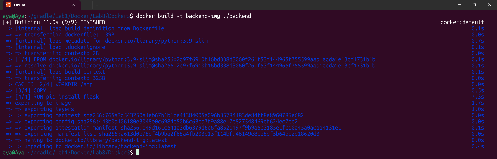
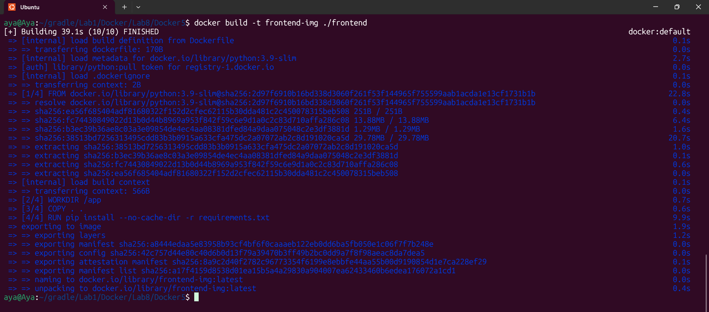
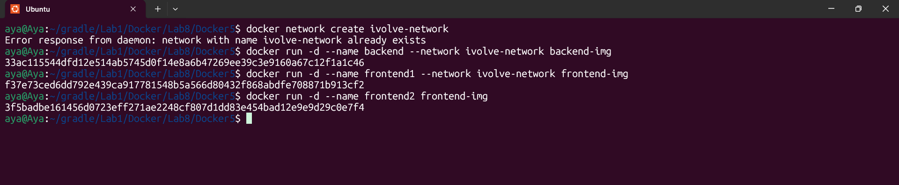
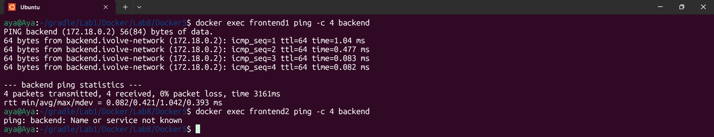
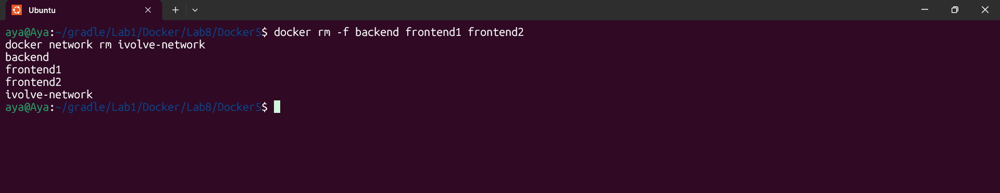

# Lab 8: Custom Docker Network for Microservices
## Overview
This lab demonstrates Container Isolation and DNS Resolution within Docker. By creating a custom bridge network, we enable secure communication between a Frontend and a Backend service using container names, while keeping other containers isolated.

##Architecture
ivolve-network: A custom bridge network.

Backend: Python Flask app running inside the network.

Frontend1: Python app inside the network (Successful communication).

Frontend2: Python app in the default network (Isolated - Communication fails).

---

## Implementation Steps

### 1. Building Images
```bash 
docker build -t frontend-img ./frontend
docker build -t backend-img ./backend
```


 
### 2. Network & Containers Setup
```bash
docker network create ivolve-network

docker run -d --name backend --network ivolve-network backend-img
docker run -d --name frontend1 --network ivolve-network frontend-img
docker run -d --name frontend2 frontend-img
```


### 3. Verification
Success Case: Pinging backend from frontend1 works perfectly because they share the same custom network.

Failure Case: Pinging backend from frontend2 fails because containers in the default bridge network cannot resolve names of containers in other networks.

Network Creation: docker network ls

Communication Success: docker exec frontend1 ping -c 4 backend

Communication Failure: docker exec frontend2 ping -c 4 backend


---

##  What I Learned
Difference between Default Bridge and User-defined Bridge.

How Docker uses an internal DNS server to map container names to IP addresses.

How to implement Network Isolation for better security in Microservices.

## Cleanup
```bash
docker rm -f backend frontend1 frontend2
docker network rm ivolve-network
```

