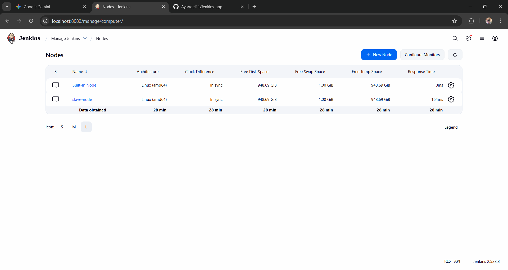
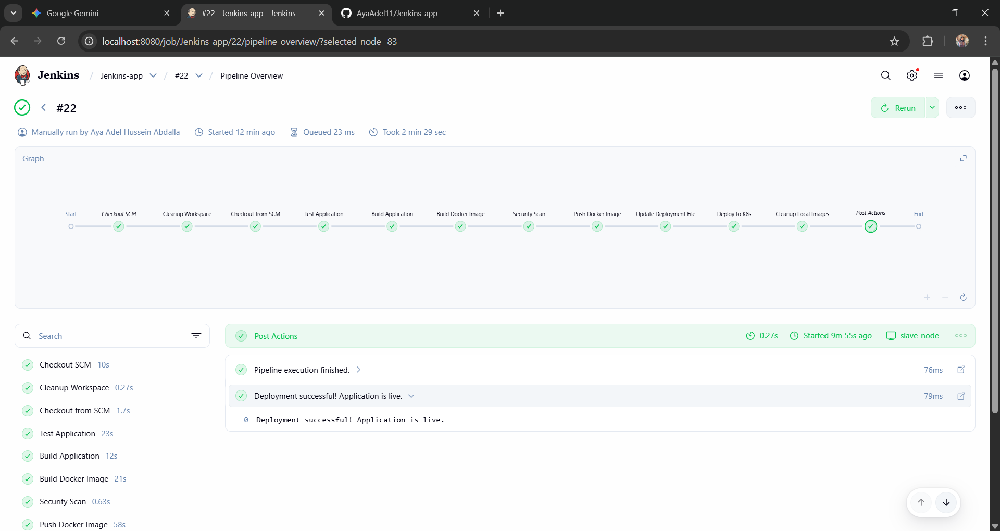
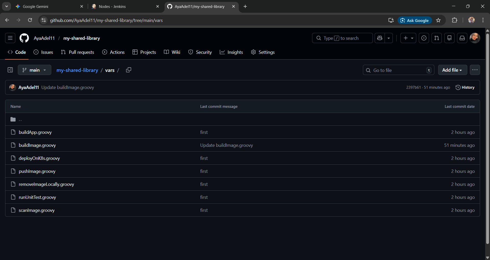

# Multi-Stage CI/CD Pipeline for Java Spring Boot 🚀
This repository contains a robust, automated CI/CD pipeline designed to build, secure, and deploy a Java Spring Boot application. The project leverages Jenkins Shared Libraries to promote code reusability and maintain a clean, professional Jenkinsfile.

## 🛠 Tech Stack
Java & Maven: Application framework and build tool.

Jenkins: Automation server for pipeline orchestration.

Jenkins Shared Libraries: Custom Groovy scripts for modular pipeline stages.

Docker: Containerization of the application.

Trivy: Security vulnerability scanning for Docker images.

Docker Hub: Image registry for storing versioned builds.

Kubernetes (Minikube): Container orchestration for deployment.

## 🏗 Pipeline Workflow
The pipeline consists of the following automated stages:

SCM Checkout: Pulls the latest source code from GitHub.

App Build: Compiles and packages the Java application into a JAR file using Maven.

Docker Build: Utilizes a Shared Library to build a Docker image from the provided Dockerfile.

Security Scan: Runs Trivy to scan the image for vulnerabilities before pushing.

Image Push: Tags the image with the Build ID and latest, then pushes it to Docker Hub.

K8s Deployment: Updates the deployment.yaml and deploys the new image to the Kubernetes cluster.

## 🚀 Setup & Installation
### 1. Prerequisites
Jenkins installed and configured with a Slave Node (Linux).

Docker and Minikube installed on the Slave Node.

Trivy installed for security scanning.

### 2. Jenkins Configuration
Ensure the following credentials are added to your Jenkins Global Credentials:

docker-hub-creds: Your Docker Hub username and password.

github-creds: SSH or PAT for GitHub access.

### 3. Kubernetes Access for Jenkins
To allow Jenkins to communicate with your local Minikube cluster without permission issues, a symbolic link approach is recommended:

###  Run on the Slave Node
sudo ln -s /home/your-user/.kube /var/lib/jenkins/.kube
sudo ln -s /home/your-user/.minikube /var/lib/jenkins/.minikube
sudo chown -R jenkins:jenkins /var/lib/jenkins/.kube
sudo chown -R jenkins:jenkins /var/lib/jenkins/.minikube

## 📝 Key Features & Troubleshooting
Modular Design: Build logic is abstracted into vars/buildImage.groovy for easy maintenance.

Dynamic Tagging: Images are tagged using ${BUILD_NUMBER} to ensure traceability and easy rollbacks.

Automated Cleanup: The pipeline includes a cleanup stage to remove old local Docker images, saving disk space on the build agent.

401 Unauthorized Fix: Resolved by ensuring proper Docker logout/login and credential synchronization between the Host and the Jenkins user.

### 📊 Verification
Once the pipeline finishes successfully :

Developed by: [Aya Adel] 👩‍💻
