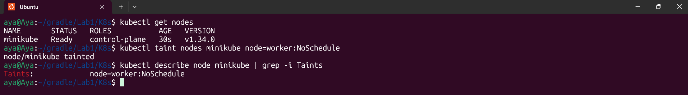

# Lab 10: Node Isolation Using Taints in Kubernetes

## Objective
The goal of this lab is to demonstrate how to isolate a Kubernetes node using **Taints**. This prevents pods from being scheduled on specific nodes unless they have a matching **Toleration**.

## Steps Performed

### 1. Verify Cluster Nodes
First, we check the available nodes in the cluster to identify the target node.
- **Command:** `kubectl get nodes`

### 2. Apply Taint to the Node
We apply a Taint with the key `node`, value `worker`, and effect `NoSchedule`.
- **Command:** `kubectl taint nodes minikube node=worker:NoSchedule`

### 3. Verify the Taint (Description)
We describe the node to ensure the taint has been successfully applied to the specifications.
- **Command:** `kubectl describe node minikube | grep Taints`

## Expected Outcome
The node is now tainted. Any new pod will remain in a `Pending` state unless it has a specific toleration for `node=worker:NoSchedule`.

