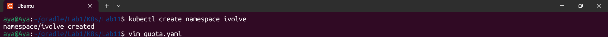
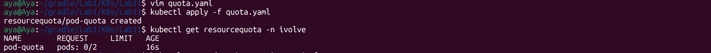
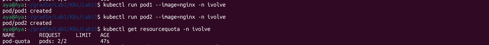
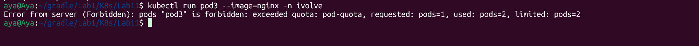

# Lab 11: Namespace Management and Resource Quota Enforcement

## Objective
This lab demonstrates how to manage cluster resources by creating a dedicated **Namespace** and enforcing a **Resource Quota** to limit the number of running pods. This is crucial for multi-tenant environments to prevent resource exhaustion.

## Steps Performed

### 1. Create a Custom Namespace
We create a logical isolation for our resources named `ivolve`.
- **Command:** `kubectl create namespace ivolve`


### 2. Define and Apply Resource Quota
A Resource Quota is created to limit the maximum number of pods in the `ivolve` namespace to **2 pods**.

**quota.yaml:**
```yaml
apiVersion: v1
kind: ResourceQuota
metadata:
  name: pod-quota
  namespace: ivolve
spec:
  hard:
    pods: "2"
```
Command:```bash  kubectl apply -f quota.yaml```



### 3. Verify Quota Enforcement
We verify that the quota is active and check the usage limits.

Command:```bash  kubectl get resourcequota -n ivolve ```


### 4. Testing the Quota (Enforcement Test)
We attempt to run 3 pods to test if the quota will block the third one.

Pod 1 & 2: Created successfully.



Pod 3: Blocked by Kubernetes Scheduler.


