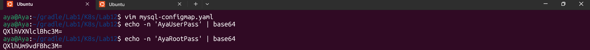
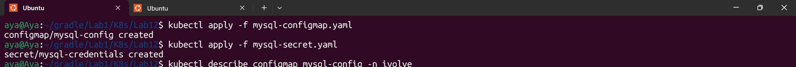
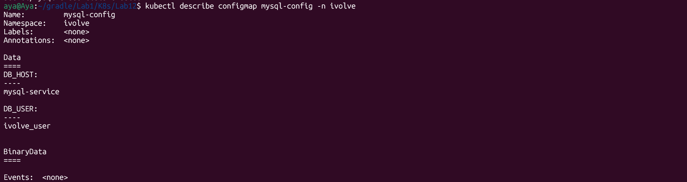
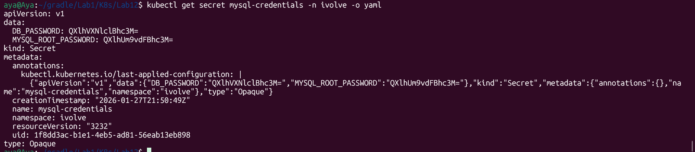

# Lab 12: Managing Configuration and Sensitive Data with ConfigMaps and Secrets

## Objective
The purpose of this lab is to demonstrate the best practices for managing application configurations in Kubernetes. We aim to decouple environment-specific settings (using **ConfigMaps**) and sensitive credentials (using **Secrets**) from the application logic.

## Steps Performed

### 1. Generating Secure Credentials
Since Kubernetes Secrets require data to be stored in **base64** encoding, we generated the encoded values for our database user and root passwords via the terminal.
- **Command:** `echo -n 'password' | base64`
- **Verification:** Captured in `create-passwds.png`.




### 2. Creating Configuration Resources
We defined two main resources:
- **ConfigMap (`mysql-config`)**: Stores non-sensitive data like `DB_HOST` and `DB_USER`.
- **Secret (`mysql-credentials`)**: Stores sensitive data like `DB_PASSWORD` and `MYSQL_ROOT_PASSWORD`.

We applied these configurations to the `ivolve` namespace using:
```bash
kubectl apply -f mysql-configmap.yaml
kubectl apply -f mysql-secret.yaml
```


### 3. Verification and Inspection
We verified that the resources were correctly created and that the Secret data is obfuscated (not plain text).

- **ConfigMap Detail**:` kubectl describe configmap mysql-config -n ivolve`



- **Secret Detail**:` kubectl get secret mysql-credentials -n ivolve -o yaml`



