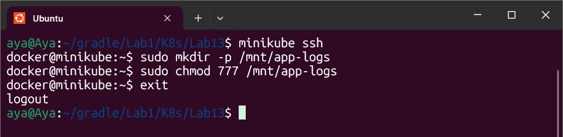
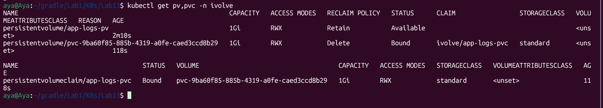

# Lab 13: Implementation Guide

## Objective

The goal of this lab is to configure Persistent Storage in Kubernetes. This ensures that application logs are preserved even if the Pods are deleted or restarted. We implement this using Persistent Volumes (PV) and Persistent Volume Claims (PVC) with a hostPath configuration.

## Implementation Evidence

### 1. Preparing the Node Storage
Before configuring Kubernetes resources, we accessed the node to create the physical directory that will hold the logs and assigned the necessary permissions (777) to ensure the cluster can write to it.

### 2. Provisioning the Persistent Volume (PV)
We defined a Persistent Volume of 1Gi using the hostPath type. The access mode was set to ReadWriteMany to support multiple pod replicas, and the reclaim policy was set to Retain to keep the data safe even if the claim is deleted.

### 3. Claiming Storage (PVC)
We created a Persistent Volume Claim to request the storage defined in the PV. For the binding to succeed, we ensured that the Access Mode (ReadWriteMany) and Size (1Gi) perfectly match the PV's specifications.

### 4. Verification of Binding
The final and most important step is verifying that the PVC has successfully found and "bound" to the PV.

---
