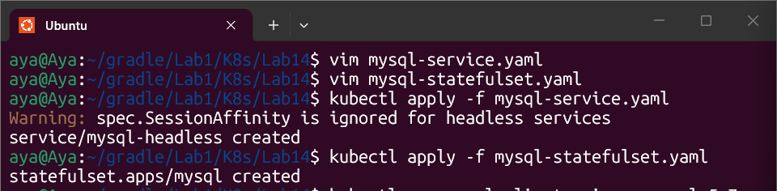
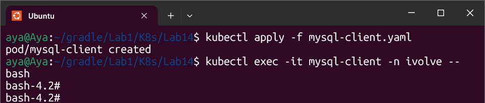
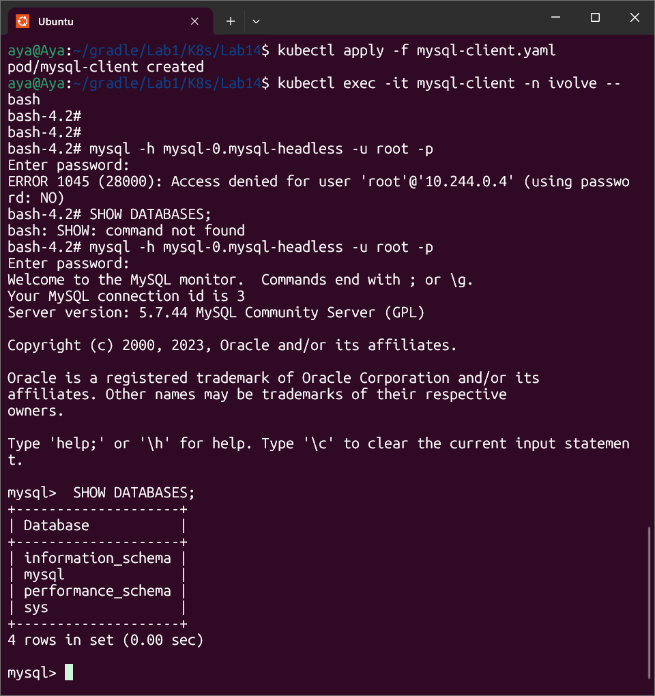

# Lab 14: StatefulSet with Headless Service

## Objective
Deploying a reliable MySQL database using a **StatefulSet** to ensure stable identity and persistent storage, exposed via a **Headless Service** for direct pod communication.

---

## Implementation Evidence

### 1. Resources Deployment
Successfully created the Headless Service (ClusterIP: None) and the MySQL StatefulSet. The pods are configured to tolerate node taints and consume sensitive data from Kubernetes Secrets.

---

### 2. Overcoming Resource Quotas & Taints
To verify the database, a temporary client pod (`mysql-client`) was deployed with the necessary **Tolerations** to be scheduled on the worker node.

---

### 3. Database Connection & Verification
The final proof of success: connecting to the `mysql-0` pod via the headless service. The database successfully authenticated the root user using the password stored in our **Secret**.

---

