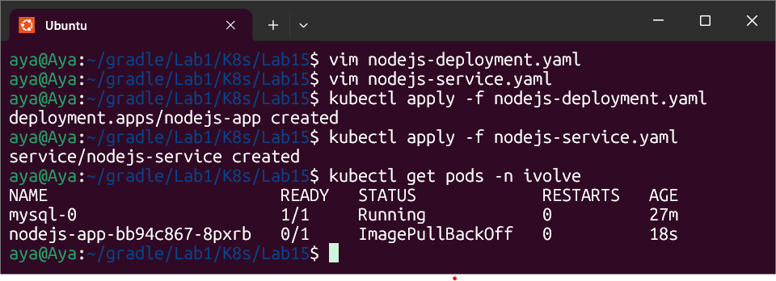
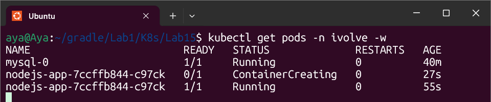
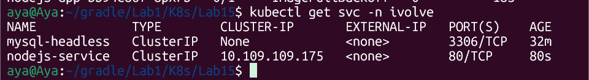

# Lab 15: Full Application Stack Deployment

## Objective
The final integration lab: Deploying a Node.js backend that connects to our MySQL database, ensuring high availability (within quota limits) and persistent logging.

---

## Implementation Details

### 1. Node.js Deployment Configuration
- **Image:** Used custom Docker image `ayaadel02/node-app:v1.0`.
- **Secrets:** Injected `MYSQL_ROOT_PASSWORD` as an environment variable from the secret created in Lab 12.
- **Toleration:** Added toleration for the `node=worker:NoSchedule` taint to allow scheduling on the worker node.
- **Persistence:** Mounted the `app-logs-pvc` to `/app/logs` for persistent application logging.

### 2. Service Discovery
Created a **ClusterIP** service named `nodejs-service`. This acts as an internal load balancer, providing a stable IP to access the Node.js replicas.

---

## Verification & Troubleshooting

### Overcoming ImagePullBackOff
Initially, the deployment failed due to an incorrect image name/tag. After verifying the repository on Docker Hub, the manifest was updated to the correct tag (`v1.0`), resulting in a successful pull.

### Resource Quota Enforcement
As observed, only **one** Node.js pod is running alongside the MySQL pod. The second replica was blocked by the **ResourceQuota** (Limit: 2 pods per namespace), proving the quota is actively managing cluster resources.

