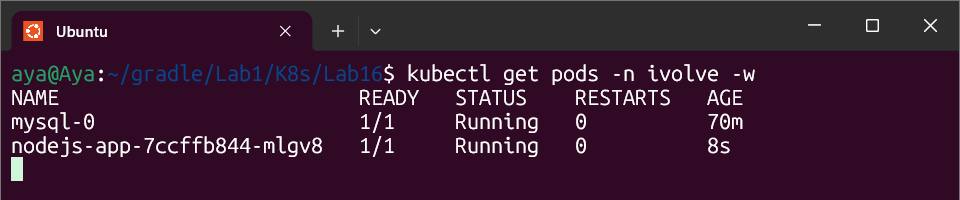
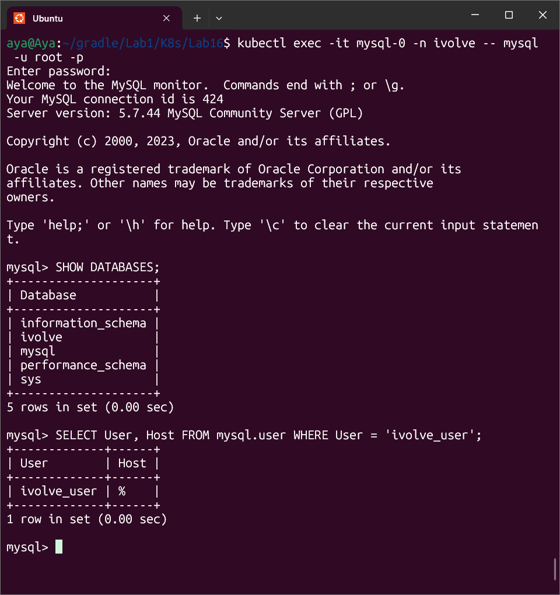

# Lab 16: Automated Database Setup via Init Container

## Objective

Automate the creation of the application database and user privileges before the Node.js application starts running, ensuring the backend finds its environment ready.

## Implementation Evidence

### 1. Init Container Configuration

Added an initContainers section to the Node.js Deployment using the mysql:5.7 image.

Key Tasks Performed:

Connectivity Check: A loop to ensure the MySQL service is fully ready before executing commands.

DB Creation: Automatically runs CREATE DATABASE IF NOT EXISTS ivolve;.

User Provisioning: Creates ivolve_user and grants all privileges on the ivolve database.

### 2. Environment Variables

Sensitive data like the MySQL root password was securely pulled from the existing Kubernetes Secret:

Secret Name: mysql-credentials

Key: MYSQL_ROOT_PASSWORD

---

## Verification Results

Pod Lifecycle Observation
During deployment, the pod status transitioned through the Init stage successfully:

STATUS: Init:0/1 (Running DB setup)

STATUS: PodInitializing

STATUS: Running (Main application started)

## Database Validation
After the pod reached Running status, manual verification inside the MySQL pod confirmed the success:

Database: ivolve exists in the database list.

User: ivolve_user is present in the mysql.user table with correct permissions.

---
*Generated by Automation Script*
