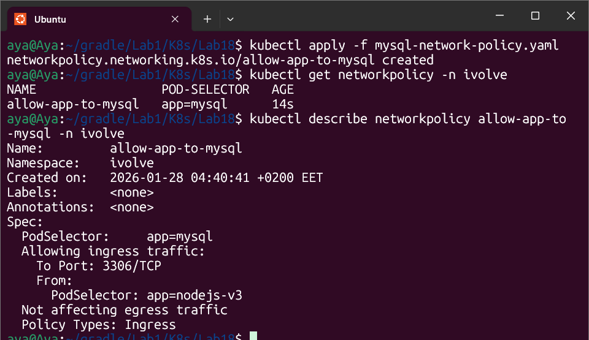

# Lab 18: Network Policy for Database Security

## 🎯 Objective
Implementing a **Zero-Trust** network security model by restricting database access. The goal is to ensure that **only** the Node.js application can communicate with the MySQL database on its specific port.

---

## 🛠️ Network Policy Configuration
I created a NetworkPolicy named `allow-app-to-mysql` with the following specifications:

* **Target Pods:** Labeled `app: mysql`.
* **Policy Type:** `Ingress` (Incoming traffic).
* **Allowed Source:** Pods labeled `app: nodejs-v3`.
* **Allowed Port:** TCP `3306` (MySQL).


---

## 🚀 Implementation & Verification

### 1. Apply Policy

```bash
kubectl apply -f mysql-network-policy.yaml
```

### 2. Verify Status

```bash
kubectl get networkpolicy -n ivolve
```

### 3. Describe Policy Details

```bash
kubectl describe networkpolicy allow-app-to-mysql -n ivolve
```

