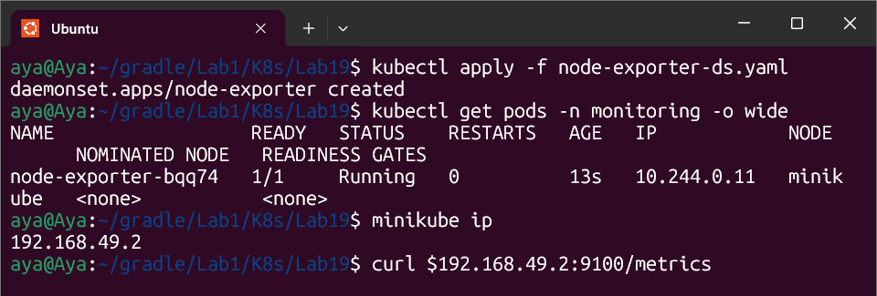
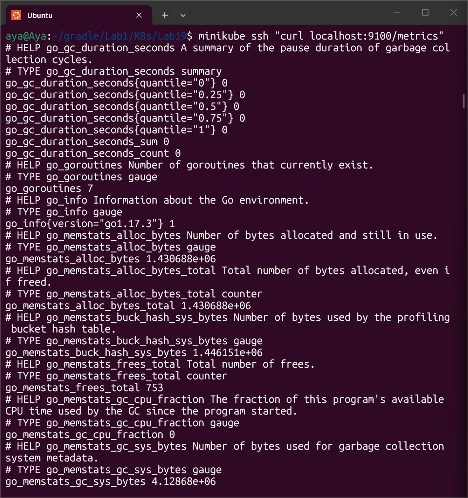

# Lab 19: Infrastructure Monitoring with DaemonSet

## 🎯 Objective
Deploying a system-wide monitoring agent using a **DaemonSet**. This ensures every node in the cluster automatically runs a `node-exporter` pod to collect hardware and OS-level metrics.

---

## 🛠️ Implementation Details
* **Namespace:** Created a dedicated `monitoring` namespace.
* **Resource:** `DaemonSet` named `node-exporter`.
* **Image:** `prom/node-exporter:v1.3.1`.
* **Tolerations:** Configured to allow scheduling on all nodes (including control-plane) by tolerating all existing taints.
* **Network:** Exposed via `hostPort: 9100` for direct node-level access.

---

## ✅ Verification & Results

### 1. Pod Scheduling

Verified that one pod is running on each node using:
```bash
kubectl get pods -n monitoring -o wide
```


## 2. Metrics Exposure
Successfully confirmed that metrics are exposed by accessing the endpoint from within the node:

```bash
minikube ssh "curl localhost:9100/metrics"
```


## 📊 Sample Output (Captured Metrics):

node_cpu_seconds_total: Real-time CPU usage per mode.

node_memory_MemTotal_bytes: Total system memory detected.

node_disk_read_bytes_total: Disk I/O monitoring data.
