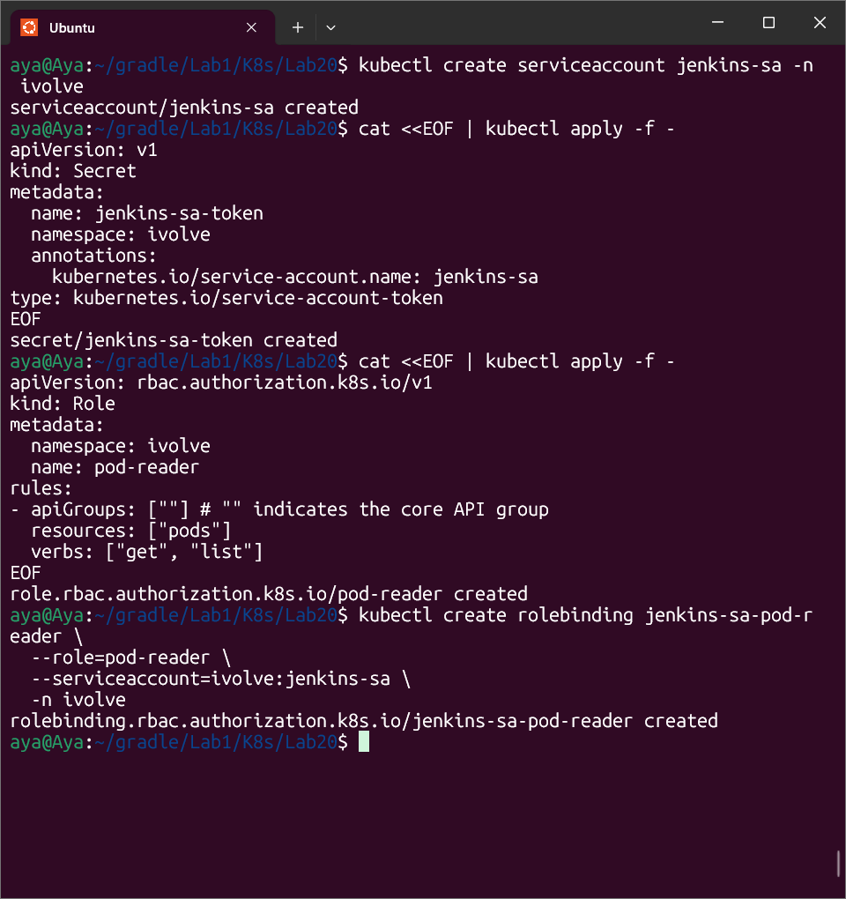

# Lab 20: Securing Kubernetes with RBAC

## 🎯 Objective
Implementing **Role-Based Access Control (RBAC)** to grant the minimum necessary permissions to a Service Account. This ensures that an external tool like Jenkins can only monitor pods without having administrative access.

---

## 🛠️ Implementation Steps
1. **Service Account:** Created `jenkins-sa` in the `ivolve` namespace.
2. **Authentication:** Provisioned a long-lived Token via a Kubernetes Secret linked to the Service Account.
3. **Authorization (Role):** Defined a Role named `pod-reader` that strictly allows `get` and `list` operations on Pod resources.
4. **Binding:** Created a `RoleBinding` to connect the `jenkins-sa` to the `pod-reader` role.

---

## ✅ Validation Results
I used the `kubectl auth can-i` command to impersonate the service account and verify permissions:

* **List Pods:** `YES` (Access Granted).
* **Delete Pods:** `NO` (Access Denied).
* **Create Deployments:** `NO` (Access Denied).

---

## 💡 Key Takeaways
* **Principle of Least Privilege:** RBAC is the primary tool for enforcing security boundaries between different services in a cluster.
* **Granular Control:** We can limit access not just by resource type, but also by the specific actions (verbs) allowed.
