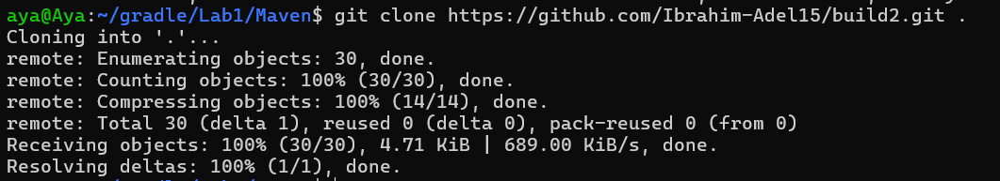
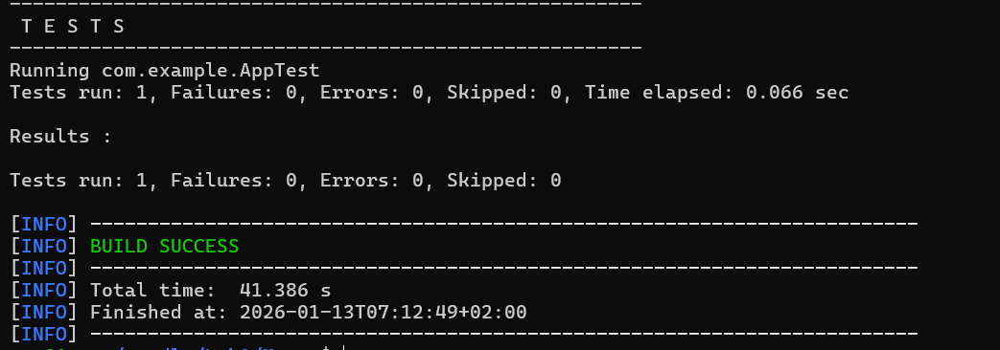
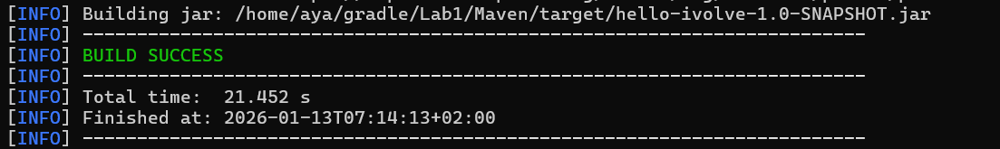

# Build Tools with Maven

This repository demonstrates a complete **Maven workflow** for building and running a Java application. The steps include cloning the source code, running unit tests, packaging the application, and running it.

---

## Step 1: Clone the Repository

Clone the source code from GitHub:

```bash
git clone https://github.com/Ibrahim-Adel15/build2.git
cd build2
```


## Step 2: Run Unit Test

Execute the unit tests for the project:

```bash
mvn test
```


## Step 3: Build the Project

Package the project into a JAR file using Maven:

```bash
mvn package
```


## Step 4: Run the Application

Run the packaged Java application using:

```bash
java -jar target/hello-ivolve-1.0-SNAPSHOT.jar
```


---

## Summary

The full workflow of using Maven in this project:

- Clone the repository from GitHub.
- Run unit tests to verify functionality.
- Build the JAR artifact with Maven.
- Run the application using the Java runtime.
